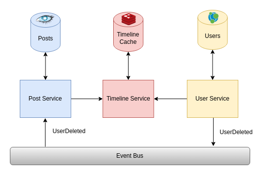

# Jubs Network
This is a work in progress. The goal is to develop a social network with the following architecture:



## Quickstart
You can run all the services and databases with the following command:
```bash
docker compose up
```

Alternatively, you can run the services one by one using the `docker-compose.yml` inside each directory.

After running for the first time, you need to create the tables/collections and load data:
```bash
cd post-service/
pip install -r requirements.txt
python -m scripts.create-tables
python -m scripts.etl
```

```bash
cd follow-service/
pip install -r requirements.txt
python -m scripts.etl
```

## Data
 Database | Type | Name | Data
----------|------|------|-----
Cassandra | Table | Posts | username (partition key), posted_on (clustering key), body, likes
Neo4j | Graph | Follows | (:Person {username, password, bio, picture}) -> [:FOLLOWS] -> (:Person)
Redis | Key-value | TimelineCache | username -> [post1, post2, ...]

## Services
Service | Function | Method | Endpoint
--------|----------|--------|---------
User | get_user | GET | /users/<_username>
User | search_users | GET | /users
User | create_user | POST | /users
User | edit_user | PUT | /users/<username>
User | delete_user | DELETE | /users/<username>
User | login | POST | /auth/login
User | verify_token | POST | /auth/token/verify
Post | get_posts | GET | /posts
Post | create_post | POST | /posts/<username>
Post | edit_post | PUT | /posts/<username>/<posted_on>
Post | like_post | PUT | /likes/<post_user>/<posted_on>
Post | delete_post | DELETE | /posts/<username>/<posted_on>
Follow | get_followings | GET | /followings/<username>
Follow | get_followers | GET | /followers/<username>
Follow | get_recommendation | GET | /followers/recommendation/<username>
Follow | follow | POST | /follow/<username>/<followed>
Follow | unfollow | DELETE | /follow/<username>/<followed>

Specific methods in API Gateway:
Function | Method | Endpoint
---------|--------|---------
logout | DELETE | /auth/logout/<username>
get_timeline | GET | /timeline/<username>
